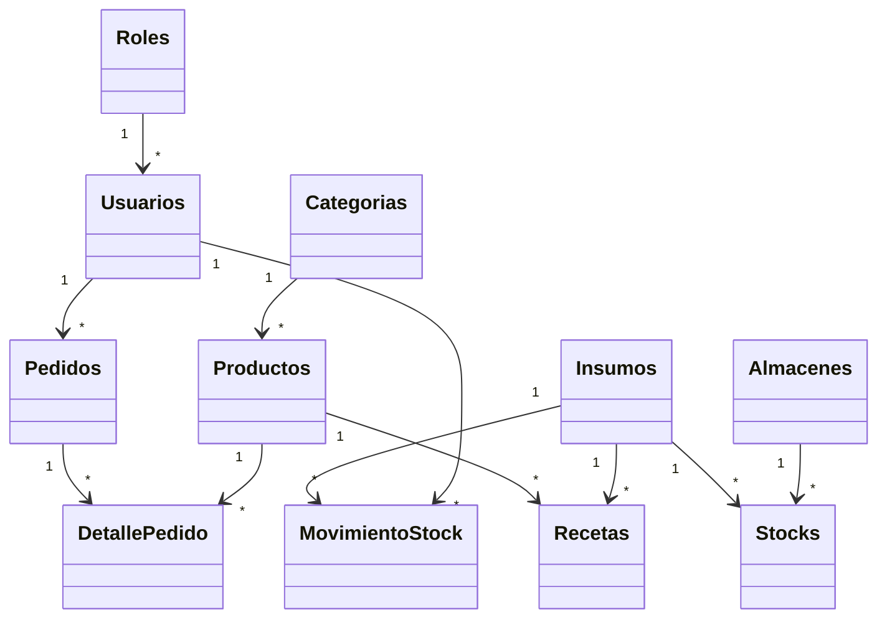
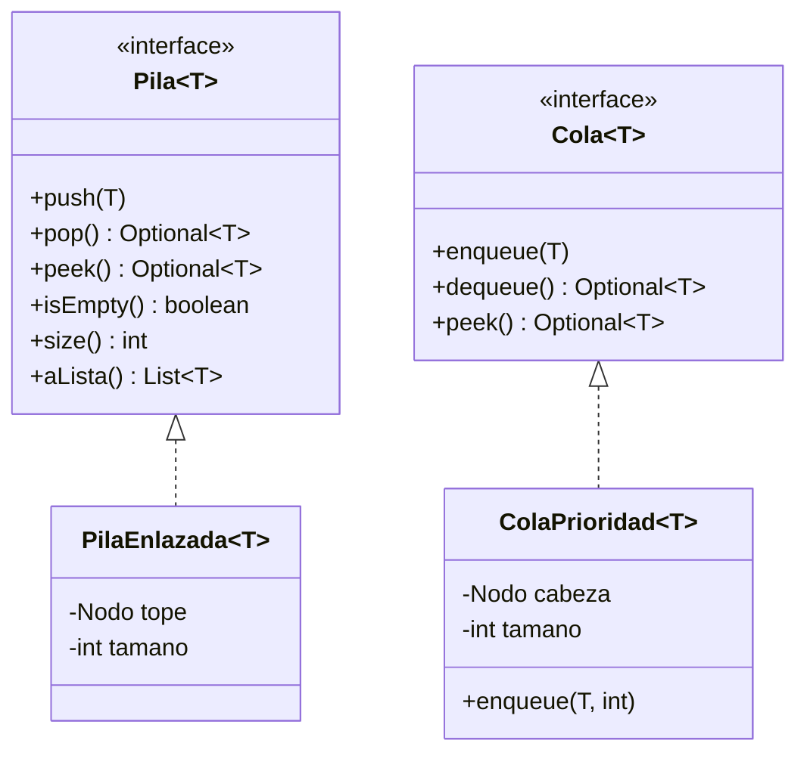

# INFORME TÉCNICO — Sistema de Gestión para Cafetería MYPE "coffee-system"

> Contenido listo para volcar a `.docx`. Los datos entre corchetes `[ ]` son **placeholders**: reemplázalos antes de entregar. La estructura sigue el Anexo 1 de la consigna del curso.

---

## I. Carátula

<div align="center">

**[LOGO UTP]**

**UNIVERSIDAD TECNOLÓGICA DEL PERÚ**

Facultad: **[FACULTAD]**
Carrera: **[CARRERA]**

**Curso:** Algoritmos y Estructuras de Datos

**Título del trabajo:** Sistema de Gestión para Cafetería MYPE — *coffee-system*

**Ciclo:** [CICLO]  ·  **Grupo:** TF_Grupo[NN]

**Integrantes:**
- [INTEGRANTE 1]
- [INTEGRANTE 2]
- [INTEGRANTE 3]
- [INTEGRANTE 4]
- [INTEGRANTE 5]

**Docente:** [DOCENTE]

**Sede:** [SEDE]  ·  **Año:** [AÑO]

</div>

---

## II. Índice

1. [Capítulo 1. Aspectos Generales](#iii-capítulo-1-aspectos-generales)
   - A. Descripción del problema
   - B. Objetivos del sistema
2. [Capítulo 2. Diseño de la Aplicación](#iv-capítulo-2-diseño-de-la-aplicación)
   - A. Descripción de los módulos
   - B. Diseño de las clases
3. [Capítulo 3. Aplicación de los temas del curso](#v-capítulo-3-aplicación-de-los-temas-del-curso)
4. [Conclusiones](#vi-conclusiones)
5. [Recomendaciones](#vii-recomendaciones)
6. [Bibliografía](#viii-bibliografía)

---

## III. Capítulo 1. Aspectos Generales

### A. Descripción del problema

Las micro y pequeñas empresas (MYPE) del rubro cafetería suelen gestionar sus ventas, su inventario y su caja de forma manual (cuadernos, hojas de cálculo sueltas). Esto genera problemas concretos:

- **Ventas sin control:** no hay un registro confiable de qué se vendió, cuánto y quién atendió; las boletas se hacen a mano y se pierden.
- **Inventario a ciegas:** no se sabe con exactitud cuánto insumo (leche, café, azúcar) queda, y se descubre el desabastecimiento recién cuando falta en plena atención.
- **Sin visión del negocio:** el dueño no tiene forma rápida de ver las ventas del día, compararlas con el mes anterior o identificar el producto más vendido para tomar decisiones.
- **Errores del personal:** al tomar un pedido, un mesero se equivoca y no tiene manera cómoda de corregir la última acción.

El sistema **coffee-system** resuelve esto con una aplicación que digitaliza el punto de venta (POS), el control de stock, la emisión de boletas y el análisis de ingresos, con acceso diferenciado por rol (**Administrador** y **Mesero**).

### B. Objetivos del sistema

**Objetivo general:** Desarrollar una aplicación que permita a una cafetería MYPE registrar sus ventas, controlar su inventario de insumos y analizar sus ingresos, aplicando el paradigma orientado a objetos y las estructuras de datos vistas en el curso.

**Objetivos específicos:**
1. Autenticar a los usuarios y restringir las funciones según su rol (Administrador / Mesero).
2. Registrar pedidos en un punto de venta, descontando automáticamente el stock de insumos según la receta de cada producto.
3. Emitir la boleta de cada pedido con su detalle y total.
4. Controlar el stock: registrar ingresos de insumos, mantener el saldo y permitir **deshacer** el último ingreso (estructura **Pila**).
5. Permitir al mesero **deshacer** la última acción de su carrito de venta (estructura **Pila**).
6. Ordenar la atención de pedidos por orden de llegada mediante una **Cola con prioridad**.
7. Brindar al administrador un panel con indicadores del día y reportes de ingresos, incluido un reporte mensual construido como **matriz** (producto × día).

---

## IV. Capítulo 2. Diseño de la Aplicación

> **Nota de forma:** la consigna plantea una aplicación de consola con "menú principal". Este proyecto, aprobado por el docente, se implementó como **aplicación web** (backend REST en Java con Spring Boot + frontend en HTML/CSS/JavaScript). Por ello, la sección de "opciones del menú" se presenta como la **navegación por pantallas** de la aplicación, que cumple el mismo rol que un menú de consola.

### A. Descripción de los módulos

La aplicación se organiza en módulos funcionales. En el backend cada módulo corresponde a un conjunto de paquetes (controlador + servicio + repositorio + entidades); en el frontend, a una o más pantallas.

| # | Nombre del módulo | Funcionalidades del módulo |
|---|---|---|
| 1 | Autenticación y Seguridad | Inicio de sesión con correo y contraseña; emisión y validación de token JWT; control de acceso por rol (ADMIN/MESERO); cifrado de contraseñas (BCrypt). |
| 2 | Pedidos / Punto de Venta (POS) | Ver el catálogo con disponibilidad; armar el carrito; **deshacer** la última acción del carrito (Pila); confirmar el pedido; descuento automático de stock según receta. |
| 3 | Boletas | Generar y consultar la boleta de un pedido (detalle de líneas y total); opción de impresión. |
| 4 | Productos / Carta | Alta, edición, eliminación y listado de productos; gestión de la **receta** (insumos y cantidades que consume cada producto). |
| 5 | Insumos | Alta, edición, eliminación y listado de insumos (materia prima) con su unidad de medida. |
| 6 | Stock y Movimientos | Registrar ingresos de insumos; mantener el saldo por insumo/almacén; ver "Últimos Ingresos"; **deshacer** el último ingreso (Pila). |
| 7 | Usuarios | Alta, edición, borrado lógico y listado de usuarios; guardas de negocio (no auto-eliminarse, no eliminar al último administrador). |
| 8 | Dashboard (Panel Admin) | Indicadores del día: ventas, número de pedidos, producto estrella y alertas de stock bajo; gráfico mensual. |
| 9 | Ingresos / Reportes | Comparativa de ingresos mes actual vs. mes anterior; ingresos por semana; detalle de boletas por rango de fechas; reporte mensual como **matriz** producto × día. |
| 10 | Despacho | Orden de atención de pedidos mediante una **Cola con prioridad** (FIFO). |
| 11 | Estructuras de Datos (TAD) | Tipos Abstractos de Datos propios: **Pila**, **Cola** y **Cola con prioridad**, implementados con listas enlazadas, sin usar las clases de `java.util`. |

**Navegación por pantallas (equivalente al "menú principal")**

Menú del **Mesero**:

| # | Opción / Pantalla | Descripción |
|---|---|---|
| 1 | Nuevo Pedido (POS) | Selecciona productos, arma el carrito, deshace la última acción y confirma la venta. |
| 2 | Mis Pedidos | Lista los pedidos de su turno, con métricas (total vendido, ticket promedio, producto estrella) y detalle de cada uno. |
| 3 | Boleta | Muestra la boleta del pedido recién confirmado. |
| 4 | Cerrar sesión | Cierra la sesión y vuelve al login. |

Menú del **Administrador**:

| # | Opción / Pantalla | Descripción |
|---|---|---|
| 1 | Dashboard | Indicadores del día y gráfico de ventas del mes. |
| 2 | Ingresos | Comparativa mensual, gráfico por semana y detalle de boletas por rango. |
| 3 | Productos | Gestiona la carta y las recetas. |
| 4 | Insumos | Gestiona la materia prima y sus unidades. |
| 5 | Control de Stock | Registra ingresos, ve el historial y deshace el último ingreso. |
| 6 | Usuarios | Administra las cuentas del personal. |
| 7 | Cerrar sesión | Cierra la sesión. |

### B. Diseño de las clases

El backend está organizado en el paquete raíz `com.coffee.backend`, con subpaquetes por responsabilidad:

```
com.coffee.backend
├── controller/     (12) Reciben las peticiones HTTP y responden JSON
├── service/        (14 interfaces) Contratos de la lógica de negocio
│   └── implement/  (14 impl.)      Implementaciones de esa lógica
├── repository/     (11) Acceso a datos (JPA / base de datos)
├── entity/         (11) Clases que representan las tablas
├── dto/request|response (38) Objetos de transferencia (entrada/salida)
├── mapper/         (2)  Convierten entidad ↔ DTO
├── security/       (4)  JWT, filtro de autenticación y configuración
├── exception/      (5)  Excepciones de negocio + manejador global
├── tad/            (4)  Estructuras de datos propias (Pila, Cola, ColaPrioridad)
└── bootstrap/      (2)  Rehidratan estructuras en memoria al arrancar
```

A continuación se describen las clases más relevantes por paquete. (Los DTO son `records` simples de transporte de datos; se resumen al final.)

#### Paquete: `tad` — Estructuras de datos propias (núcleo del curso)

**Clase / Interfaz: `Pila<T>`** — Contrato del TAD Pila (LIFO).

| Método | Descripción |
|---|---|
| `push(T item)` | Apila un elemento en el tope. |
| `pop()` | Desapila y devuelve el tope (`Optional.empty()` si está vacía). |
| `peek()` | Mira el tope sin quitarlo. |
| `isEmpty()` | Indica si la pila está vacía. |
| `size()` | Cantidad de elementos. |
| `aLista()` | Copia el contenido a una lista (tope→base) sin modificar la pila. |

**Clase: `PilaEnlazada<T>` (implements `Pila<T>`)** — Implementación con lista enlazada simple.

| Atributo | Descripción |
|---|---|
| `Nodo<T> tope` | Cabeza de la lista = elemento en el tope. |
| `int tamano` | Contador de elementos (permite `size()` en O(1)). |
| *(clase interna)* `Nodo<T>` | Nodo con `valor` y enlace `siguiente`. |

| Método | Descripción |
|---|---|
| `push` | Crea un nodo, lo enlaza delante del tope y lo vuelve el nuevo tope. O(1). |
| `pop` | Quita el nodo del tope y devuelve su valor; mueve el tope al de abajo. O(1). |
| `peek` / `isEmpty` / `size` | Consultas O(1). |
| `aLista` | Recorre los nodos y copia los valores tope→base. O(n). |

**Interfaz `Cola<T>` y clase `ColaPrioridad<T>`** — TAD Cola (FIFO) con prioridad, también con lista enlazada propia.

| Método | Descripción |
|---|---|
| `enqueue(T)` / `enqueue(T, prioridad)` | Encola respetando la prioridad (mayor primero) y FIFO dentro de la misma prioridad. |
| `dequeue()` | Desencola la cabeza (el siguiente a atender). |
| `peek()` | Mira la cabeza sin quitarla. |
| `isEmpty()` / `size()` / `aLista()` | Consultas y copia sin drenar. |

#### Paquete: `entity` — Modelo de datos (tablas)

| Clase | Qué representa | Atributos principales |
|---|---|---|
| `Usuarios` | Cuenta de acceso | `usuarioId`, `nombreUsuario`, `apellidoUsuario`, `correoUsuario`, `claveCifrada`, `activo`, `roles` |
| `Roles` | Rol (ADMIN/MESERO) | `rolID`, `nombreRol` |
| `Productos` | Producto de la carta | `productoId`, `nombreProducto`, `precioActual` (BigDecimal), `categorias`, `recetas` |
| `Categorias` | Categoría de la carta | `categoriaId`, `nombreCategoria` |
| `Recetas` | Insumo que consume un producto | `recetaID`, `cantidadUsada`, `productos`, `insumos` |
| `Insumos` | Materia prima | `idInsumo`, `nombreInsumo`, `unidad` |
| `Stocks` | Saldo de un insumo en un almacén | `codigoStock`, `cantidad`, `insumos`, `almacenes` |
| `Almacenes` | Depósito | `codigoAlmacen`, `nombreAlmacen` |
| `MovimientoStock` | Traza de un ingreso de stock | `id`, `cantidad`, `fecha`, `usuario`, `tipo`, `estado`, `codigoStock` |
| `Pedidos` | Venta hecha por un mesero | `pedidoId`, `aliasTicket`, `fechaPedido`, `usuario`, `detalles` |
| `DetallePedido` | Línea de un pedido | `detallePedidoId`, `cantidadPedida`, `precioUnitario` (BigDecimal), `productos`, `pedidos` |

#### Paquete: `service/implement` — Lógica de negocio (clases destacadas)

**Clase: `PedidoServiceImpl`** — Registro de pedidos y consultas.

| Método | Descripción |
|---|---|
| `registrarPedido(dto, correo)` | Valida stock, crea el pedido y sus líneas, descuenta el stock según receta y encola el pedido para despacho. Transaccional. |
| `obtenerBoleta(id)` | Arma la boleta con el detalle y el total (suma de líneas en `BigDecimal`). |
| `listarPedidosDeMesero(correo)` | Lista los pedidos del mesero con su total. |
| `misMetricas(correo)` | Calcula pedidos atendidos, total vendido, ticket promedio y producto estrella del día. |

**Clase: `StockServiceImpl`** — Ingresos y deshacer de stock.

| Método | Descripción |
|---|---|
| `registrarIngreso(dto, correo)` | Suma al saldo, guarda un `MovimientoStock` y lo apila en la Pila de deshacer. |
| `listarMovimientos()` | Devuelve los últimos ingresos vigentes ("Últimos Ingresos"). |
| `deshacerUltimoIngreso()` | Saca de la Pila el último ingreso, revierte el saldo y marca el movimiento como revertido (guardas de negocio incluidas). |

**Clase: `ReporteServiceImpl`** — Reportes y BI (contiene la **matriz**).

| Método | Descripción |
|---|---|
| `reporteMensual()` | Construye la **matriz** `double[][]` de ventas por producto (filas) × día (columnas) del mes. |
| `comparativa(anio, mes)` | Total del mes vs. el anterior y variación porcentual (`BigDecimal`). |
| `ingresosSemanales(desde, hasta)` | Serie de ingresos por semana con su tendencia. |
| `boletas(desde, hasta)` | Detalle de boletas emitidas en un rango. |

**Clases: `CarritoUndoServiceImpl`, `StockUndoServiceImpl`, `PedidoDespachoServiceImpl`** — Poseen y operan las estructuras de datos en memoria (Pila del carrito por mesero, Pila de deshacer de stock, Cola de despacho). `UsuarioServiceImpl` gestiona el CRUD de usuarios con borrado lógico y guardas (no auto-eliminarse, no borrar al último ADMIN).

#### Paquete: `controller` — Puntos de entrada HTTP

Cada controlador expone endpoints REST y aplica el rol requerido con `@PreAuthorize`. Ejemplos: `AuthController` (login), `PedidoController` (crear pedido, boleta, métricas, deshacer carrito), `StockController` (ingresos, movimientos, deshacer), `ReporteController` (matriz mensual, ingresos, boletas), `UsuarioController` (CRUD con guardas), `DashboardController` (KPIs).

#### Paquete: `security` — Autenticación

`JwtUtil` (crea/lee el token), `JwtFilter` (intercepta cada petición y autentica según el token), `SecurityConfig` (define qué rutas son públicas y activa la seguridad por método), `UserDetailsServiceImpl` (carga el usuario desde la base para autenticarlo).

#### Paquete: `exception` — Manejo de errores (control de excepciones)

`StockInsuficienteException`, `RecursoNoEncontradoException`, `ProductoNoEncontradoException`, `ReglaNegocioException` (todas extienden `RuntimeException`) y `GlobalExceptionHandler`, que las traduce a códigos HTTP claros (404, 409, 400) con un mensaje.

#### DTO (resumen)

Los paquetes `dto/request` y `dto/response` contienen `records` de transporte (entrada y salida de cada endpoint), p. ej. `LoginRequestDTO`, `PedidoRequestDTO`, `BoletaResponseDTO`, `DashboardResponseDTO`, `CarritoSnapshotDTO`. No tienen lógica; solo agrupan datos con nombres autoexplicativos.

#### Diagrama de clases (entidades) — Mermaid



#### Diagrama de las estructuras de datos (TAD) — Mermaid



---

## V. Capítulo 3. Aplicación de los temas del curso

Este capítulo responde a la pregunta clave del docente: **¿en qué parte del código se tocan los temas del curso?** Solo se declaran temas **realmente implementados**, con su ubicación exacta.

| Tema del sílabo | Dónde en el código | Cómo se aplica |
|---|---|---|
| **Arreglos unidimensionales (vectores)** | Catálogo y líneas de pedido (`List<>` en servicios como `PedidoServiceImpl`, `ProductoServiceImpl`) | Recorrido, inserción, filtrado y copia de colecciones de objetos (productos, detalles). |
| **Arreglos bidimensionales (matrices)** | `service/implement/ReporteServiceImpl.reporteMensual()` | Construcción de una **matriz** `double[][]` de ventas producto (fila) × día del mes (columna), recorrida con doble índice `[i][j]`. |
| **Tipos Abstractos de Datos (TAD)** | Paquete `tad/` (`Pila`, `Cola`, `ColaPrioridad`) | Interfaces que definen el contrato y clases que lo implementan **sin usar `java.util.Stack/Queue`**, como exige el curso. |
| **Listas enlazadas simples (nodos y apuntadores)** | Clase interna `Nodo` en `PilaEnlazada` y `ColaPrioridad` | La Pila y la Cola se construyen enlazando nodos (`valor` + `siguiente`); no se usan estructuras predefinidas. |
| **Pila (push / pop)** | `tad/PilaEnlazada`; usada en `CarritoUndoServiceImpl` (deshacer del carrito) y `StockUndoServiceImpl` (deshacer ingreso de stock) | Guarda estados anteriores (LIFO): `push` antes de cada cambio, `pop` al deshacer. |
| **Cola con prioridad (enqueue / dequeue)** | `tad/ColaPrioridad`; usada en `PedidoDespachoServiceImpl` | Ordena los pedidos por prioridad y, dentro de la misma, por orden de llegada (FIFO). |
| **Programación Orientada a Objetos** | Todo el proyecto | Encapsulamiento (entidades con getters/setters), herencia (excepciones que extienden `RuntimeException`), polimorfismo e interfaces (`Service`/`ServiceImpl`, TAD), genéricos (`Pila<T>`). |
| **Control de excepciones** | Paquete `exception/` + `GlobalExceptionHandler` | Excepciones de negocio propias capturadas de forma central y traducidas a respuestas HTTP con mensaje. |
| **Estructuras de control (condicionales / repetitivas)** | Servicios en general (p. ej. validación de stock en `PedidoServiceImpl`) | `if`/`for`/`while` para validar, recorrer y calcular (totales, matriz, métricas). |

**Fuera de alcance (declarado honestamente):** el proyecto **no** implementa árboles binarios / ABB / AVL, listas doblemente enlazadas ni circulares, pilas/colas estáticas sobre arreglos, ni operaciones de matriz como transposición, determinante o inversa. Se priorizó implementar a fondo las estructuras con un uso real en el dominio (Pila, Cola con prioridad, matriz de reporte) en lugar de agregar estructuras sin propósito funcional.

---

## VI. Conclusiones

1. Se desarrolló una aplicación funcional que digitaliza la operación de una cafetería MYPE (ventas, stock, boletas e ingresos), aplicando el paradigma orientado a objetos en un proyecto Java modular con Maven.
2. Las estructuras de datos del curso se aplicaron con **propósito real**: la Pila da la función "deshacer" del carrito y del stock, la Cola con prioridad ordena el despacho, y la matriz sustenta el reporte mensual.
3. La separación en capas (controlador → servicio → repositorio → entidad) y el uso de TAD propios facilitó que el código sea entendible, comentado y verificable con pruebas automatizadas.
4. El control de excepciones centralizado y la seguridad por roles hacen el sistema robusto frente a errores y accesos indebidos.

## VII. Recomendaciones

1. Como mejora futura, incorporar estructuras no lineales (un ABB para búsqueda de productos, o un árbol categoría→producto) para cubrir la unidad de árboles del sílabo.
2. Versionar los cambios de base de datos con una herramienta de migraciones para automatizar el despliegue.
3. Añadir más pruebas de integración de extremo a extremo antes de una puesta en producción real.
4. Ensayar la exposición cronometrada para no exceder el tiempo asignado y asegurar que el demo cubra las estructuras de datos.

## VIII. Bibliografía

- Oracle. (s.f.). *The Java™ Tutorials*. [https://docs.oracle.com/javase/tutorial/]
- VMware. (s.f.). *Spring Boot Reference Documentation*. [https://docs.spring.io/spring-boot/]
- Cormen, T., Leiserson, C., Rivest, R., & Stein, C. (2009). *Introduction to Algorithms* (3.ª ed.). MIT Press.
- Weiss, M. A. (2013). *Estructuras de datos en Java*. Pearson.
- [Agregar aquí el material del curso y las guías del docente utilizadas.]

---

> Documento generado a partir del código y la documentación técnica del repositorio *coffee-system*. Reemplazar los placeholders antes de la entrega.
